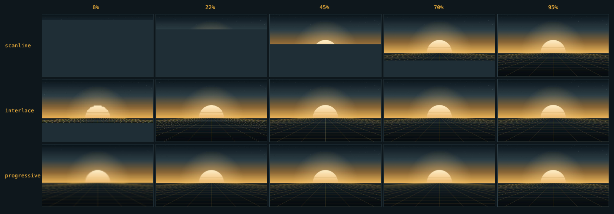

# retro-image

1990年代のブラウザの画像読み込みを再現する Web Component。依存ゼロ、1 ファイル。



デモは `dist/standalone.html` をブラウザで開けば動きます（JS も画像も埋め込み済みの 1 ファイルなので、ローカルサーバーは要りません）。

## これは何か

回線が遅かった頃、画像は一気に出ませんでした。上から一行ずつ現れるもの、ブラインドが閉じるように粗い像から埋まっていくもの、全体がぼやけた状態から徐々にピントが合うもの。あれは演出ではなく、画像フォーマットのデコード順がそのまま画面に出ていただけです。

このコンポーネントは、その 3 方式を当時のデータの届き方どおりに描き直します。

| mode | 由来 | 見え方 |
|---|---|---|
| `scanline` | ベースライン JPEG / 非インターレース GIF | データがスキャンライン順に並んでいるので、届いたぶんだけ上から描かれる |
| `interlace` | GIF89a のインターレース | 8 行おき → 4 行おき → 2 行おき → 残り の 4 パス。各行を次のパスが埋めるまで縦に引き伸ばすので、ブラインドが閉じるように見える |
| `progressive` | プログレッシブ JPEG | DCT 係数が低周波から届くため、粗い全体像が先に出て、そこへ細部が乗っていく |

## 使い方

既存の `` を包むだけです。

```html
<script type="module" src="/retro-image.js"></script>

<retro-image mode="interlace" duration="1400" once>
  
</retro-image>
```

JS が動かなければ `` がそのまま表示されます。

既定ではビューポートに入ったとき一度だけ再生されます。見逃されると困る場合は `controls` を付けると再生ボタンが生えます（属性の値がラベル）。

```html
<retro-image mode="scanline" controls="もう一度見る">
  
</retro-image>
```

### 属性

| 属性 | 既定 | 意味 |
|---|---|---|
| `mode` | `interlace` | `scanline` / `interlace` / `progressive` |
| `duration` | `1400` | 演出の長さ（ミリ秒） |
| `speed` | — | `14.4k` / `28.8k` / `33.6k` / `56k` / `isdn`。指定すると `duration` より優先され、画像の実バイト数から所要時間を算出する |
| `max-duration` | `8000` | `speed` 使用時の上限。長すぎる待ちを切る |
| `bytes` | 自動 | 転送量を明示。未指定なら Resource Timing から取得し、取れなければ画素数から概算する |
| `controls` | — | 再生ボタンを出す。属性の値がラベルになる（`controls="もう一度見る"`、省略時は `Replay`） |
| `manual` | — | 自動再生しない。`controls` のボタンからだけ再生する。長い演出を勝手に始めたくないとき用 |
| `once` | — | 一度再生したらセッション中は再生しない |
| `eager` | — | ビューポート待ちせず即再生。既定では画面に入ってから始まる |

### イベント / API

```js
el.addEventListener('retro:start', (e) => e.detail);  // { mode, duration }
el.addEventListener('retro:end', (e) => e.detail);    // { mode }
el.play();  // 任意のタイミングで再生（再生中なら頭から描き直す）
```

### 回線速度モード

`speed` を指定すると、画像の実バイト数から当時の所要時間を割り出します。実効スループットは `bps / 10` バイト毎秒で見積もっており、28.8k で約 2.8KB/s。当時の体感とおおむね一致します。`56k` が 53000bps なのは、V.90 の下り速度が規制で 53.3kbps に制限されていたためです。

そのまま使うと 60KB の画像で 20 秒以上待たされるので、既定では `max-duration` が 8 秒で打ち切ります。

## 実装メモ

**レイアウトを動かさない。** canvas は `position: absolute` で `` に重ねるだけで、高さを決めるのは元の img のままです。当時さんざん画面をガタつかせた「画像が届くたびに行が飛ぶ」現象は、いま CLS（Cumulative Layout Shift）と呼ばれて怒られているので、そこは再現しません。

**別オリジンの画像でも動く。** 描画を `drawImage` だけで完結させ、`getImageData` を使っていません。canvas が tainted にならないので、CORS 設定なしで動きます。走査線もインターレースも「元画像の一部を、目的の位置へ引き伸ばして描く」だけで表現できます。

**画像が消えたままにならない。** `` を隠すのは JS がそこまで到達したときだけです。再生の完了・読み込みエラー・タイムアウトのすべてが同じ復帰処理を通り、失敗保険のタイマーも張ってあります。

**縞の粗さは表示サイズ基準。** インターレースの 8 行おきを元画像の実ピクセルで刻むと、いまどきの大きな画像では縞が細かすぎて見えません。当時の見た目に合わせて、表示上の行で刻んでいます。

**`prefers-reduced-motion: reduce` なら自動再生しない。** img に触れないので通常表示のまま出ます。ユーザー自身の操作で `play()` を呼んだ場合は、意図された操作なので再生します。

## 開発

```sh
python3 tools/build.py        # index.html と dist/standalone.html を生成
python3 test/verify.py        # 実ブラウザ（Playwright）で両方を検証
python3 tools/make-image.py   # デモ画像を生成し直す
python3 tools/make-stages.py  # README の比較画像を生成し直す
```

テストには `playwright` の Python 版が要ります（`pip install playwright && playwright install chromium`）。

### ファイル構成

```
retro-image.js         コンポーネント本体。配布するのはこれ 1 つ
dist/standalone.html   1 ファイル完結のデモ。ブラウザで直接開ける
index.html             外部ファイル参照版のデモ。使い方の見本を兼ねる（配信が必要）
demo/template.html     上 2 つの共通ソース
```

## ライセンス

MIT
